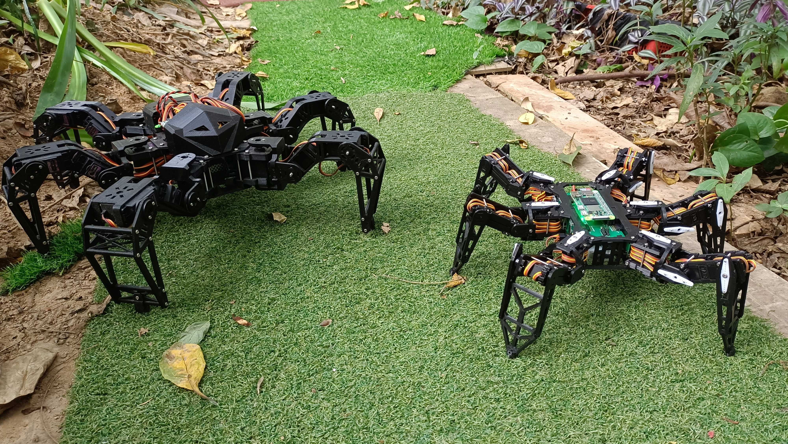

# PiHexa V1
Hexapod project using Raspberry Pi Zero 2 W and Python.   

## Setup raspberry pi zero 2 W
Suppose the raspberry pi OS is installed:
* WIFI connection configuration through `/etc/wpa_supplicant.conf` file.
* Make raspberry pi (Bluetooth) to be discoverable and paired.
* Enable  I2C Interface for PCA9685 communication.
* Open SSH for debugging.

## Running the main process

```
sudo cd ~/PiHexa18/pihexa && python3 running.py
```

## Brief introduction
* This project is the python version of the [hexapod-v2-7697](https://github.com/SmallpTsai/hexapod-v2-7697) project written in C++. I modified the size and structure, and redesigned the PCB.
* **Remote control** is done via `BLE` of `Raspberry Zero 2 W`
* It has 6 legs and each has 3 joint. So there are total `18` **Servo motors** (Only support GuoHua `A0090` now and TowerPro `MG92B` in the future)
* NXP `PCA9685` x 2 are used to control these servo motors
* **Power** comes from a `2S Lipo battery (7.4v)`. Also 7 x `mini360 DC-DC` step down voltage regulator are used. One to provide `5V` to Raspberry Pi, The other six to provide `5V` to each legs (1 mini360 serve 3 servo)
* The **body** is 3D printed PLA. I use `Anycubic i3 Mega S`.
* Everything (3D STL, PCB schematic, Python source code) are included in the project under **GPL license**, Happy making!

